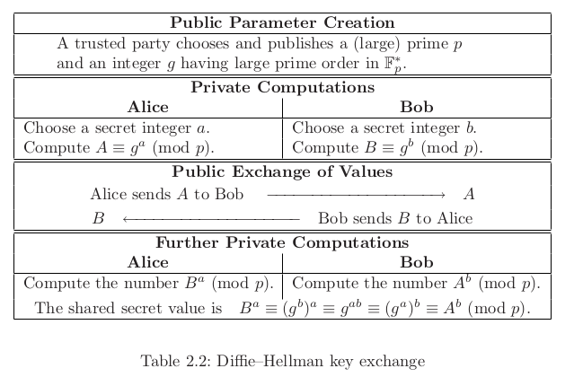
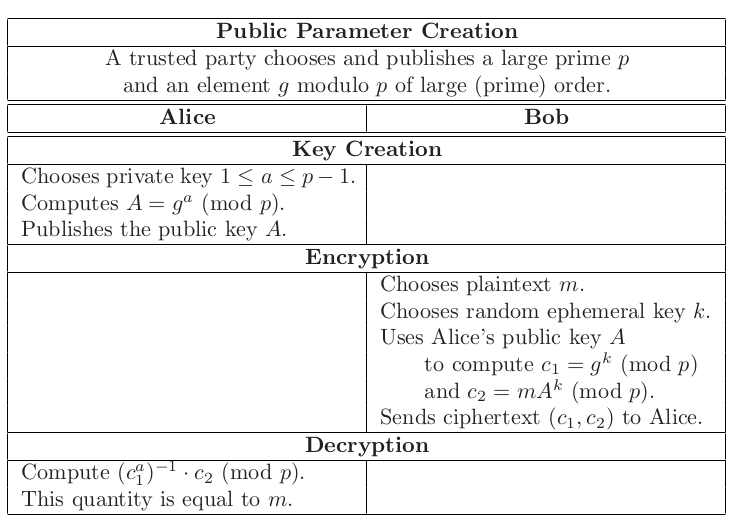
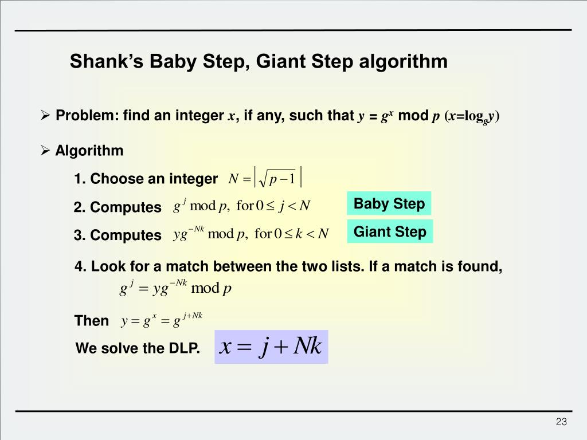
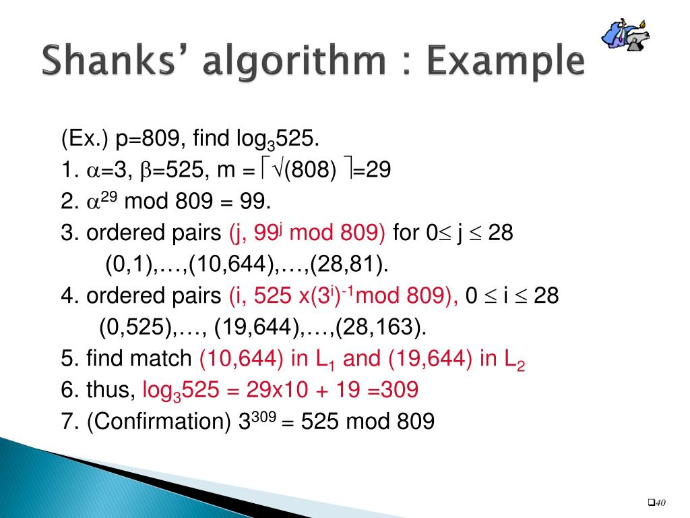

# An Introduction to Mathematical Cryptography

## 2.2 The discrete logarithm problem

Let p be a (large) prime. [`Theorem 1.3.1`](./week-10.md#15-powers-and-primitive-roots-in-finite-fields) tells us that there exists a primitive element g. This means that every nonzero element of $\mathbb{F}_p$ is equal to some power of g. In particular, $g^{p−1} = 1$ by Fermat's little theorem (Theorem 1.25), and no smaller power of g is equal to 1\. Equivalently, the list of elements

$1, g, g^2 , g^3 , . . . , g^{p−2} \in \mathbb{F}_p$

is a complete list of the elements in $\mathbb{F}_p$ in some order (Holds since a generator g must exist).

`Definition` Let g be a primitive root for $\mathbb{F}_p$ (i.e field with a prime number of elements) and let h be a nonzero element of $\mathbb{F}_p$. The Discrete Logarithm Problem (DLP) is the problem of finding an exponent x such that

$g^x \equiv h \pmod p $

The number x is called the discrete logarithm of h to the base g and is denoted by $log_g (h)$.

`Definition`. Let G be a group whose group law we denote by the symbol $\star$. _T Discrete Logarithm Problem_ for G is to determine, for any two given elements g and h in G, an integer x satisfying $g \star g \star g \star · · · \star g = h$ (x times).

## 2.3 Diffie-Hellmann key exchange



One could think that the difficulty of Eve in decrypting the messages here is to solve the Discrete Logarithm Problem (DLP) as $g^a$ and $g^b$ as well as g and p are known. One just have to solve for a and b.

In practice the problem is easier:

`Definition`. Let p be a prime number and g an integer. The _Diffie–Hellman Problem (DHP)_ is the problem of computing the value of $g^{ab} \pmod p$ from the known values of $g^{a} \pmod p$ and $g^{b} \pmod p$.

It is clear that the DHP is no harder than the DLP. If Eve can solve the DLP, then she can compute Alice and Bob's secret exponents a and b from the intercepted values $A = g^a$ and $B = g^b$ , and then it is easy for her to compute their shared key $g^{ab}$ .

# 2.4 The ElGamal public key cryptosystem



"the second public key cryptosystem (after RSA) after the DH paper was published, follows DH most closely "

How does Alice decrypt Bob's ciphertext (c1 , c2 )? Since Alice knows a, she can compute the quantity $x \equiv c_1^a \pmod p$,

We now show that $x^{-1} · c_2 := m$

$ x^{-1} · c_2$

$ \equiv (c^a_1 )^{−1} · c_2 $, since $x \equiv c^a_1 \pmod p $

$\equiv (g^{ak} )^{−1} · (mA^k ) \pmod p $,since $c_1 \equiv g^k$ , $c_2 \equiv mA^k \pmod p$,

$\equiv (g^{ak} )^{−1} · (m(g^a )^k ) \pmod p$, since $A \equiv g^a \pmod p$,

$\equiv m$ since the $g^{ak}$ terms cancel out.

So by knowing a, Alice can compute $x^{-1} · c_2$ and hence decrypt the ciphertext. The inverse $x^{-1}$ cam be calculated by the [Extended Euclidean Algorithm (EEA)](week-10.md) very efficiently.

```
One of the goals of modern cryptography is to identify an underlying hard problem
like the Diffie–Hellman problem and to prove that a given cryptographic con-
struction like ElGamal is at least as hard to attack as the underlying problem.
```

`` `Proposition 2.10``. Fix a prime p and base g to use for ElGamal encryption. Suppose that Eve has access to an oracle that decrypts arbitrary ElGamal ciphertexts encrypted using arbitrary ElGamal public keys. Then she can use the oracle to solve the Diffie–Hellman problem described on page 67.

# 2.6 How hard is the discrete logarithm problem?

Question: What is a good measure of "hardness?" Answer: The number of operations necessary for a computer using the most efficient method currently known.

`Definition (Order Notation)`. Let f (x) and g(x) be functions of x taking values that are positive. We say that "f is big-O of g" and write

$f(x) = O (g(x))$

if there are positive constants c and C such that

$f (x) \le cg(x)$ for all x ≥ C.

In particular, we write $f (x) = O(1)$ if f (x) is bounded for all $x \ge C$.

`Proposition 2.15`. If the limit

$\lim_{x \to \inf } \frac{f (x)}{g(x)} $

_exists (and is finite), then_ $f (x) = O( g(x)) $.

`Definition` Suppose that we are trying to solve a certain type of mathematatical problem, where the input to the problem is a number whose size may vary. We are interested in knowing how long it takes to solve the problem in terms of the size of the input. Typically, one measures the size of the input by its number of bits, since that is how much storage it takes to record the input.

Suppose that there is a constant A ≥ 0, independent of the size of the input, such that if the input is O(k) bits long, then it takes $O(k^A)$ steps to solve the problem. Then the problem is said to be solvable in polynomial time.

If we can take A = 1, then the problem is solvable in linear time, and if we can take A = 2, then the problem is solvable in quadratic time. Polynomial-time algorithms are considered to be _fast_ algorithms.

On the other hand, if there is a constant c > 0 such that for inputs of size O(k) bits, there is an algorithm to solve the problem in $O(e^{ck})$ steps, then the problem is solvable in exponential time. Exponential-time algorithms are considered to be _slow_ algorithms.

Intermediate between polynomial-time algorithms and exponential-time algorithms are subexponential-time algorithms. These have the property that for every $\epsilon > 0$, they solve the problem in $O_{\epsilon} (e^{ek})$ steps. This notation means that the constants c and C appearing in the definition of order notation are allowed to depend on $\epsilon $. For example, in Chapter 3 we will study a subexponential-time algorithm for the integer factorization problem whose running time is $O(e^{c\sqrt{k\log{k}}})k$ steps.

As a general rule of thumb in cryptography, problems solvable in polyno- mial time are considered to be "easy" and problems that require exponential time are viewed as "hard," with subexponential time lying somewhere in between.

# 2.7 A collision algorithm for the DLP (:= Discrete Logarithm Problem)

Proposition 2.20 (Trivial Bound for DLP). Let G be a group and let g ∈ G be an element of order N . (Recall that this means that $g^N = e$ and that no smaller positive power of g is equal to the identity element e.) Then the discrete logarithm problem (2.2)

$g^x = h $

can be solved in O(N ) steps, where each step consists of multiplication by g.

`Proposition 2.22` (_Shanks's Babystep–Giantstep Algorithm_). Let G be a group and let g ∈ G be an element of order N ≥ 2\. The following algorithm solves the discrete logarithm problem $g^x = h$ in $O( \sqrt N \log N )$ steps.

(1) Let $n = 1 + \lfloor \sqrt N \rfloor $, so in particular, $n > \sqrt N$ .

(2) Create two lists,

List 1: $e, g, g^2 , g^3 , . . . , g^n$

List 2: $h, h · g^{−n }, h · g^{−2n} , h · g^{−3n} , . . . , h · g^{−n²}. 2$

(3) Find a match between the two lists, say $g^i = hg^{−jn}$ .

(4) Then $x = i + jn$ is a solution to $g^x = h$.




