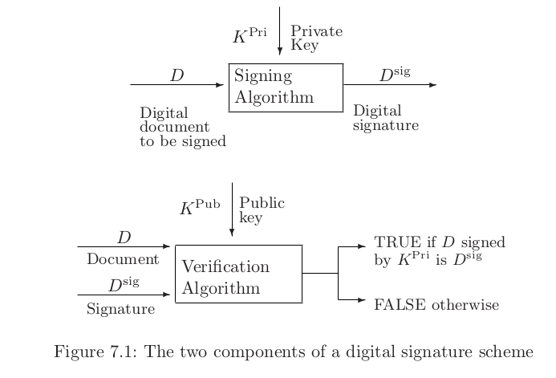
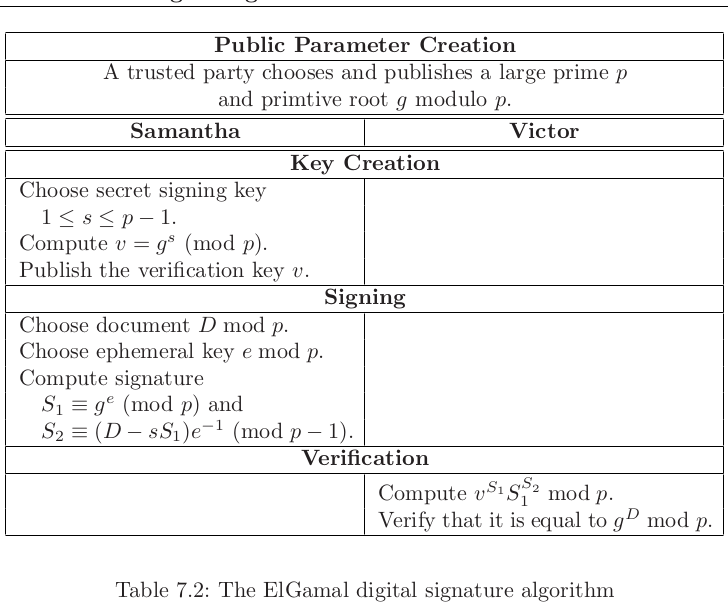
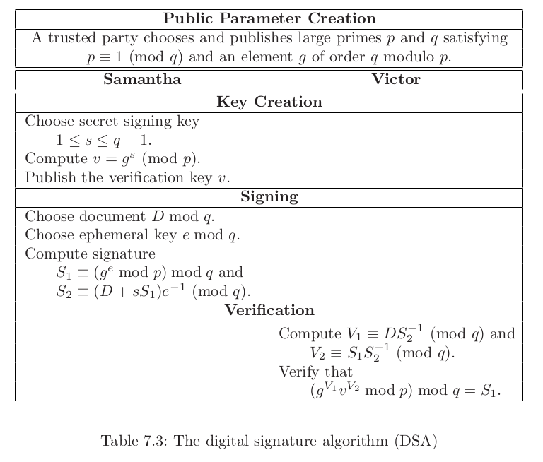

# Chapter 4.3: Digital Signatures

# 7.1 What is a digital signature

It would be very inefficient to sign a full document. The signature would likely be as large as the original document.

The standard solution to this problem is to use a hash function, which is an easily computable function

$Hash : (\text{arbitrary size documents}) → \set{0, 1}^ k$

# 7.2 RSA digital signatures

_skipped as we skipped the RSA chapter_

## 7.3.1 ElGamal digital signatures

Victor verifies the signature by checking that

$v^{S1} S1^{S2} \mod p = g^D \mod p$.

Why does ElGamal work?

$v^{S1} S1^{S2} ≡ g^{sS1} · g^{eS2} ≡ g^{sS1 +eS2} ≡ g^{ sS1 +e(D−sS1 )e −1} ≡ g^{ sS1 +(D−sS1 )} ≡ g^{ D} $

## 7.3.2 DSA digital signatures

The _Digital Signature Algorithm (DSA)_ significantly shortens the signature by working in a subgroup of $F^{∗}_p$ of prime order q.

      

_Note that DSA uses an additional large prime q_ _image_caption_ In a typical example we would have $2^{1000} < p < 2^{2000}$ and $2^{160} < q < 2^{320}$. As q < p, we can reduce the size of the signatures.

`perfectly secure` meaning that it is secure even if the adversary has unbounded computational resources

`statistical secure` an adversary would be unable to distinguish from randomness--what other cryptographic scheme looks to obtain pre-image resistance

`computational security`, meaning that it is only secure as long as the adversary has bounded computational resources
