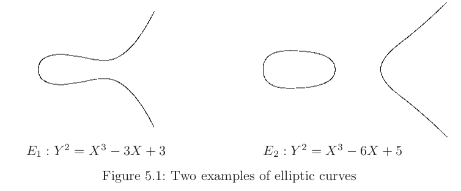
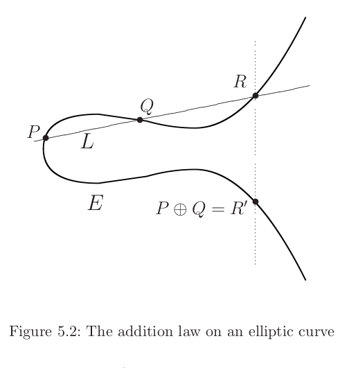
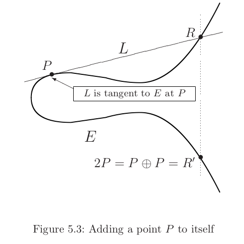
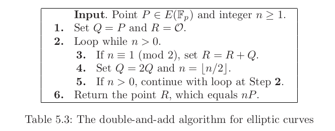
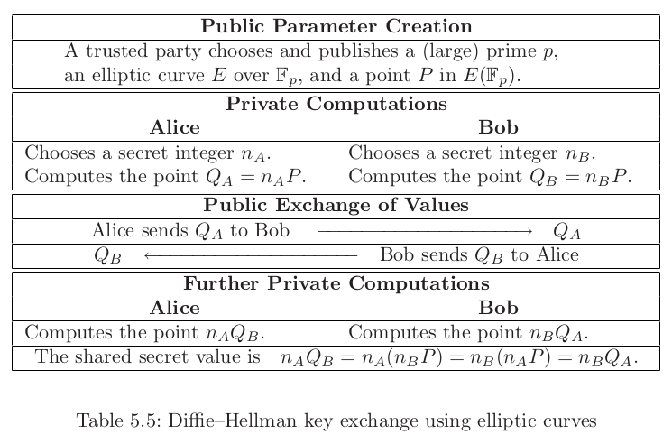
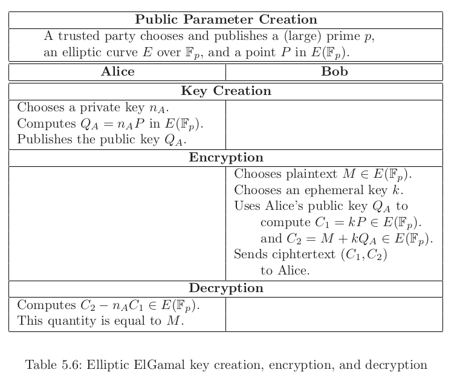
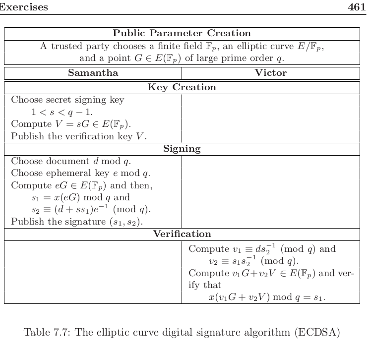

# Chapter 5: Elliptic Curves and Cryptography

great visuals to understand elliptic curves on a high level can be found here. (<https://curves.xargs.org/>)

## 5.1 Elliptic Curves

An elliptic curve 2 is the set of solutions to an equation of the form

$ Y^2 = X^3 + AX + B$

Equations of this type are called Weierstrass equations after the mathematician who first studied them. 

An amazing feature of elliptic curves is that there is a natural way to take two points on an elliptic curve and "add" them to produce a third point.

Special rule for addition to itself

A special rule for addition of Point P (a, b) to the reflection of Point P' (a, -b). The line L through P and P' is the vertical line x = a with no third point of intersection with the curve. The solution is to create an extra point O that lives "at infinity". In other words

$ P ⊕ P' = O$

We say that

`Definition`. An elliptic curve E is the set of solutions to a Weierstrass equation

$ E : Y^2 = X^3 + AX + B$

, together with an extra point O, where the constants A and B must satisfy

$ 4A^3 + 27B^2 \ne 0$

`Theorem 5.5.` Let E be an elliptic curve. Then the addition law on E has the following properties:

1. Identity: $ P ⊕ O = P$
2. Inverse: $ P ⊕ (-P) = O$
3. Associativity: $ P ⊕ (Q ⊕ R) = (P ⊕ Q) ⊕ R$
4. Commutativity: $ P ⊕ Q = Q ⊕ P$

Our next task is to find explicit formulas to enable us to easily add and subtract points on an elliptic curve.

`Theorem 5.6 (Elliptic Curve Addition Algorithm)`.

Let E :

$Y^2 = X^3 + AX + B$

be an elliptic curve and let P1 and P2 be points on E.

(a) If P1 = O, then P1 + P2 = P2 .

(b) Otherwise, if P2 = O, then P1 + P2 = P1 .

(c) Otherwise, write P1 = (x1 , y1 ) and P2 = (x2 , y2 ).

(d) If x1 = x2 and y1 = −y2 , then P1 + P2 = O.

(e) Otherwise, define λ by

$λ = \frac{y_2 − y_1}{x_2 − x_1} \text{ if } P_1 \ne P_2 $

$λ = \frac{ 3x_1^2 + A}{2y_1} \text{ if } P_1 = P_2 $

and let

$x_3 = λ^2 − x_1 − x_2$ and $y_3 = λ(x_1 − x_3 ) − y_1 $

Then $P_1 + P_2 = (x_3 , y_3 )$.\mathbb{F}

We call above form the "Weierstrass form" of an elliptic curve. The Weierstrass form is not the most efficient form for performing elliptic curve arithmetic. However, it is the most convenient form for proving theorems about elliptic curves. We can write some elliptic curves in their Montgomery form. The Montgomery form is more efficient for performing elliptic curve arithmetic. However, it is not as convenient for proving theorems about elliptic curves.

Weierstrass:
$ Y^2 = X^3 + AX + B$

Montgomery:
$ BY^2 = X^3 + AX^2 + X$

see: https://youtu.be/D2lM8RxNW5w

We can not convert any Elliptic Curve to Montgomery form, but only some class of curves.
## 5.2 Elliptic curves over finite fields

`Theorem 5.9` Let E be an elliptic curve over $\mathbb{F}_p$ and let P and Q be points in $E(\mathbb{F}_p)$.

(a) The elliptic curve addition algorithm (Theorem 5.6) applied to P and Q yields a point in $E(\mathbb{F}_p)$. We denote this point by P + Q.

(b) This addition law on $E(\mathbb{F}_p)$. satisfies all of the properties listed in Theorem 5.5\. In other words, this addition law makes $E(\mathbb{F}_p)$. into a finite group.

We want to know how many values satisfy the equation $Y^2 = X^3 + AX + B$ over $\mathbb{F}_p$. Adding in the extra point O, we know that $\char"0023 E(\mathbb{F}_p)$ has at most 2p + 1 points with the two points mirrored at th the x-axis. However, this estimate is considerably larger than the true size. In reality we can three different cases:

First our point can be quadratic residue modula p with 2 points. Second our point is nonresidue modula p with 0 point. Or third point is equal to 0, in which case we have 1 point. With the the first and the second case happening with roughly equal probability we can expect to have roughly

$\char"0023 E(\mathbb{F}_p) = 50 \% * 2 p + 1 = p + 1$

We can use the Hasse Theorem to determine the exact number of points.

`Theorem 5.11 (Hasse)`. Let E be an elliptic curve over $E(\mathbb{F}_p)$. Then

$\char"0023 E(\mathbb{F}_p) = p + 1 - t_p$ with $t_p$ satisfying $|t_p| \le 2 \sqrt p$

`Definition`. The quantity

$ t_p = p + 1 - \char"0023 E(\mathbb{F}_p) $ appearing in Theorem 5.11 is called the _trace of Frobenius_ for $E /\mathbb{F}_p$ .

## 5.3 The elliptic curve discrete logarithm problem (ECDLP)

`Definition`. Let E be an elliptic curve over the finite field $\mathbb{F}_p$ and let P and Q be points in $E(\mathbb{F}_p )$. The _Elliptic Curve Discrete Logarithm Problem_ (ECDLP) is the problem of finding an integer n such that Q = nP . By analogy with the discrete logarithm problem for $\mathbb{F}_p^*$, we denote this integer n by

$n = log_P (Q) $

and we call n the elliptic discrete logarithm of Q with respect to P.

## 5.3.1 The Double-and-Add Algorithm

It appears that the ECDLP is as hard as the discrete logarithm problem for $ \mathbb{F}_p$. But how can we efficiently calculate $Q = nP$ ? We can use the Double-and-Add algorithm to solve this problem. That algorithm is similar to the _fast powering algorithm_ we used to compute $a^n$ in $\mathbb{F}_p^*$.

## 5.3.2 How hard is the ECDLP?

The collision algorithms described in Section 4.4 are easily adapted to any group, for example to the group of points $E(\mathbb{F}_p )$ on an elliptic curve. In order to solve $Q = nP$ , Eve chooses random integers $j_1 , . . . , j_r$ and $k_1 , . . . , k_r$ between 1 and p and makes two lists of points:

List #1\. $j_1P ,j_2P . . . , j_rP$ ,

List #2\. $k_1 P + Q, k_2 P + Q . . . , k_rP + Q$

# 5.4 Elliptic curve cryptography

## 5.4.1 Elliptic Diffie–Hellman key exchange

`Definition`. Let $E(\mathbb{F}_p )$ be an elliptic curve over a finite field and let P ∈ $E(\mathbb{F}_p )$. The Elliptic Curve Diffie–Hellman Problem is the problem of comput- ing the value of n1 n2 P from the known values of n1 P and n2 P .

## 5.4.2 Elliptic ElGamal public key cryptosystem

## 5.5 The evolution of public key cryptography

## Appendix: Elliptic curve digital signature algorithm (ECDSA) from chapter 7.7

Note the ephermal key e is generated randomly and is never reused. That means any signature (s1, s2) signining a message d is not unique. In contrast, q - 1 signatures exists which can all be used to sign the same message. This is called the _Ephermal Signature Problem_. 
One solution to that problem is to use a deterministic value for k as descripted in this paper: https://www.rfc-editor.org/rfc/rfc6979