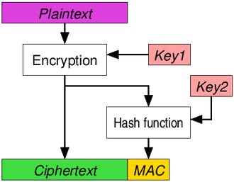
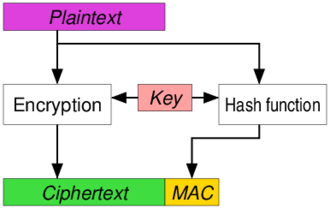
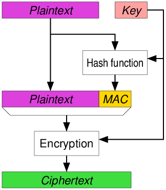

# Authenticated encryption

### sources: https://en.wikipedia.org/wiki/Authenticated_encryption

## What is it for?

The need for authenticated encryption emerged from the observation that securely combining separate confidentiality and authentication block cipher operation modes could be error prone and difficult This was confirmed by a number of practical attacks introduced into production protocols and applications by incorrect implementation, or lack of authentication (including SSL/TLS).

## Encrypt-then-MAC (EtM)

The
plaintext is first encrypted, then a MAC is produced based on the
resulting ciphertext. The ciphertext and its MAC are sent together.

Note that key separation is mandatory (distinct keys must be used for
encryption and for the keyed hash), otherwise it is potentially insecure
depending on the specific encryption method and hash function
used.

The advantage of Encrypt-then-MAC is that the MAC is on the ["outside"](https://youtu.be/zrdRZi1B7I8?t=250). This makes it easier to verify the MAC before decrypting the ciphertext and offers DDOS protection hence. Alternatively you would always have to _decrypt_ the ciphertext before you can verify the MAC.
Further reading of the pros and cons of all approaches can be found [here](https://crypto.stackexchange.com/questions/202/should-we-mac-then-encrypt-or-encrypt-then-mac).

## Encrypt-and-MAC (E&M)

A MAC is produced based on the plaintext, and the plaintext is encrypted
without the MAC. The plaintext\'s MAC and the ciphertext are sent
together.

## MAC-then-Encrypt (MtE)

A MAC is produced based on the plaintext, then the plaintext and MAC are
together encrypted to produce a ciphertext based on both. The ciphertext
(containing an encrypted MAC) is sent.
